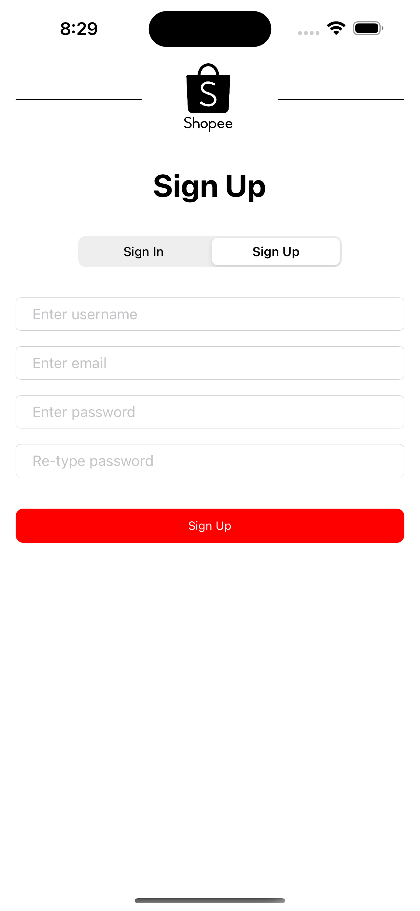
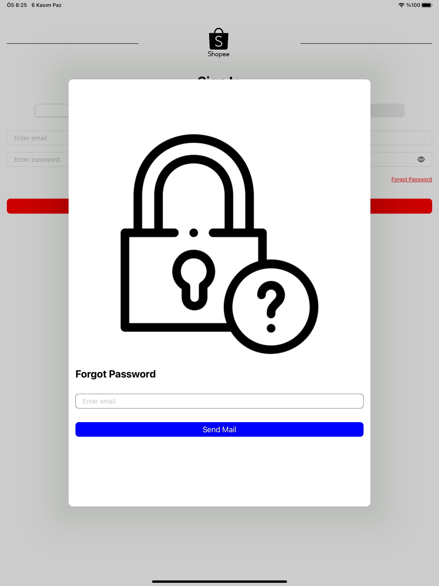

<!-- PROJECT LOGO -->
<br />
<div align="center">
  <a href="https://github.com/github_username/repo_name">
    
  </a>

<h3 align="center">Shopee App</h3>

  <p align="center">
    This app developed as a final project of Patika Pazarama iOS Bootcamp.
</div>


<!-- TABLE OF CONTENTS -->
<details>
  <summary>Table of Contents</summary>
  <ol>
    <li>
      <a href="#about-the-project">About The Project</a>
      <ul>
        <li><a href="#third-party-libraries">Third Party Libraries</a></li>
      </ul>
    </li>
    <li>
      <a href="#gif">GIF</a>
    </li>
    <li>
      <a href="#project-screenshots">Project ScreenShots</a>
      <ul>
        <li><a href="#iphone-14-pro-max---ios-16">iPhone 14 Pro Max</a></li>
        <li><a href="#ipad-pro-129-inch---ios-16">iPad Pro 12.9 inch</a></li>
        <li><a href="#iphone-se3rd-generation---ios-12">iPhone SE(3rd Generation)</a></li>
      </ul>
    </li>
    <li><a href="#license">License</a></li>
    <li><a href="#contact">Contact</a></li>
  </ol>
</details>


<!-- ABOUT THE PROJECT -->
## About The Project
In this project, FakeStore Api used and fake shopping application developed. Final project assignment is in  <a href="readMeFiles/Pazarama iOS Bootcamp Final Project.pdf" class="image fit">link </a>

You can try app with:
```
Username: test@test.com
Password: Test1234.
````

In authentication screen, user can sign up or if one has an account, can sign in directly. User's password must be min 8 characters that has minimum 1 capital and 1 special character. If user forget the password, one can use the forgot password page and change one's password vie e-mail.

In main screen, user can choose any of the product on UICollectionView. User can see the product image, product price and product name on custom view cell. When a cell clicked user can see the details of the product. On the top of the page, user can see the categories in scrollable stack view buttons. User can filter product accoring to category by pressing that buttons. On the top right on the screen, there is a basket button. By pressing the basket button, user can see the products that have benn added cart in UITableView.

In basket screen, user have chance to change the quantity of the product, remove product from cart or check out the products price. At the bottom of the page user can see the total price of products.

In details screen, user can see the product image bigger, also user can see the product name, product price, product description, ratings and total comment number. User can added product to cart and change the quantity by pressing the "+" and "-" buttons.

In search screen, user can filter the products via using product name and product category and see the results in UITableView. In custom table view cell, user can see the product image, product name and product price.

In profile page, user can see one's user name, e-mail address and profile picture. There is 2 buttons in that page which are Settings and Sign Out. By pressing the settings button user can chance the username, password and profile picture. By pressing the sign out button user can sign out securely.

In settings page, user can see the profile picture at the top of the screen. By pressing the "+" button, user can change one's profile picture. User can take a photo or can choose a photo from photo library. In this part UIImage picker used. If user already signed in and want to change the password, one can do it by filling the new password and retype password fields in that page. If these fields are blank, this means that user do not want to change passward. After pressing save changes button, all the user information updated. If user press the back button on the top left, no information will be updated.

In that project:
- UIKit user interface builded programmatically
- MVVM is used.
- SPM is used for loading packages.
- FirebaseFirestore, Firebase Authentication, Firebase Storage are used for database operations. In firestore, user information(username) and user cart's information is held. In Firebase Storage, user profile picture is held.
- Kingfisher is used for downloading images.
- For autolayout, snapkit is used. It improves the cleanliness of the code.
- For http requests, moya is used. 
- Fro special keyboard, IQKeyboardManager is used. It is great and easy to use.

### Third Party Libraries

* FirebaseFirestore
* Firebase Authentication
* Firebase Storage
* Kingfisher
* Snapkit
* Moya
* IQKeyboardManager

Note: *Logo was taken from real company and it was used only for educational purposes.* 

<!-- GIF -->
## GIF
<p align="center">

</p>


<!-- Project ScreenShots -->
## Project ScreenShots

This projects can work different sizes of devices. Some example screenshots from iPhone 14 pro Max, iPad Pro 12.9 inch and iPhone SE were added in below.


### iPhone 14 Pro Max - iOS 16
<p align="center">
  
  
  
  
  
  
  
  
  
  
</p>

### iPad Pro 12.9 inch - iOS 16
<p align="center">
  
  
  
  
  
  
  
  
  
  
</p>

### iPhone SE(3rd Generation) - iOS 12
<p align="center">
  
  
  
  
  
  
  
  
  
  
</p>


<!-- LICENSE -->
## License

Distributed under the MIT License.


<!-- CONTACT -->
## Contact

Berksu Kısmet - [@berksu_k](https://twitter.com/berksu_k) - berksukismet@gmail.com


